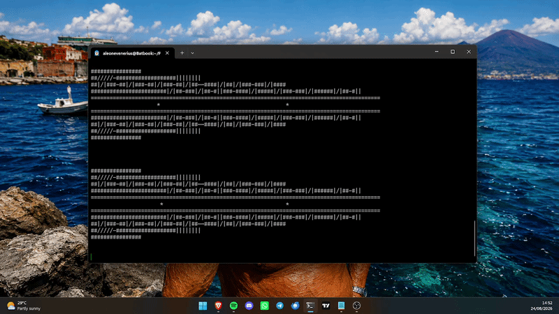

# Little LHC (Large Hadron Collider) via terminal.

## What does this project do?

This is a simple project that simulates the work of the Large Hadron Collider.

## How does the LHC work?

In broad terms, it speeds particles quickly to almost the speed of light. Then, they crash themselves.

